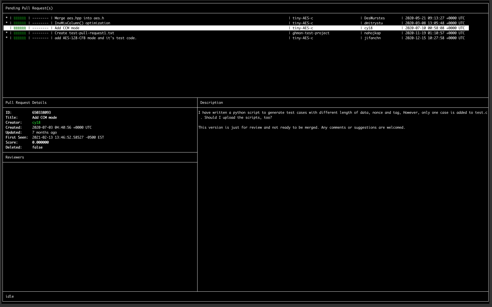

# ghmon

'_ghmon_' is a command line utility written in Go that monitors your pull requests on Github.  It provides a simple UI to list the PRs that you have opened as well as the ones which you have been requested to review, sorting them according to status, age and other criteria.

At scheduled intervals, it will refresh the list of pull requests being monitored and update the UI accordingly.



While it is still work in progress, it aims to provide a quick overview of pending review requests as well as a simple notification channel that can be used to execute local scripts based on built-in _ghmon_ criteria.

# Prerequisites

'_ghmon_' requires the GitHub CLI to be installed and for authentication having been done in order to work (see https://github.com/cli/cli).

# Installing/Running

### Binaries

Installing/running _ghmon_ as a binary involves 

```shell
bash$ go get github.com/nahojkap/ghmon
bash$ ghmon
```

Ensure that you have _${GOPATH}/bin_ added to your path

### Sources

Installing/running _ghmon_ is

```shell
bash$ git clone github.com/nahojkap/ghmon
bash$ cd ghmon
bash$ go run .
```

# Keyboard Navigation

Key | Description
----|----
Up/Down Arrows | Navigate the list of pull requests
ENTER | Opens the selected pull request in a browser
r or R | Refreshes the current list of pull requests
p or P | Purges any deleted (no longer active on GitHub) pull requests
q or Q | Exits _ghmon_

# Configuration

The following environment variables control the 

Environment Variable Name | Description | Default Value
:------------ | :------------- | :-------------
GHMON_REFRESH_INTERVAL | Interval between Github refreshes.  Any valid Go duration expression (15s, 20m, 1d, etc) | 15m
GHMON_OWN_QUERY | Github search query for users own pull requests  | is:open+is:pr+author:@me+archived:false
GHMON_REVIEW_QUERY | Github search query for users own pull requests  | is:open+is:pr+review-requested:@me+archived:false __AND__ is:open+is:pr+reviewed-by:@me+archived:false
